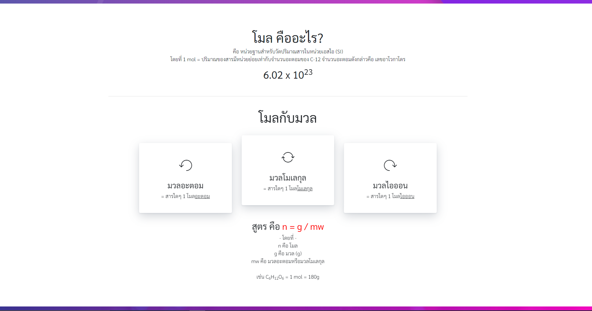
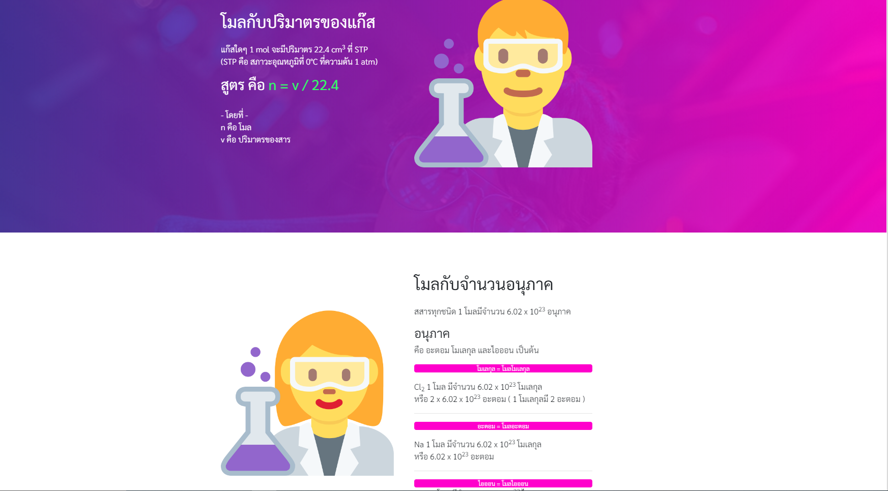

  
  <h3 align="center">Chemistry Mole</h3>
  

    A workpiece for chemistry class.
     
    <a href="https://utd.ac.th/" target="_blank"><strong>Uttaradit School »</strong></a> 
    <a href="https://feelingzexe.github.io/chemistrymole" target="_blank"><strong>Website Preview »</strong></a> 
  

# About the Project
This website is made for education purpose on chemistry class project. 
Made by Peerawit Pharkdeepinyo.

## Screenshots

